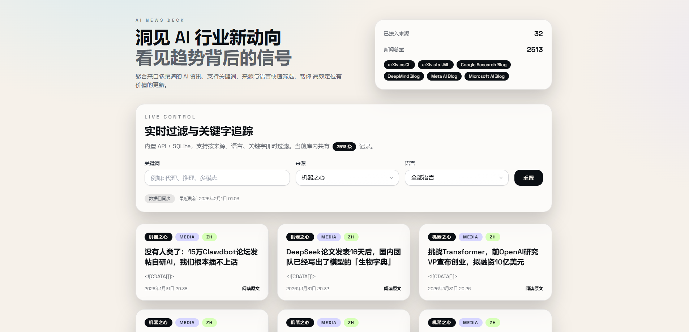

# AI News Follower


一个简单的 AI 新闻聚合器，自动抓取 RSS 源并提供搜索过滤。

地址：https://ainews.orz.ai

## 运行

```bash
pnpm install
cp .env.example .env.local
pnpm dev
```

访问 http://localhost:3000 (开发环境)

## 部署

生产环境需设置 `NEXT_PUBLIC_SITE_URL=https://ainews.orz.ai`

```bash
# 宝塔 Docker 部署
docker compose up -d

# 或手动构建
pnpm build
pnpm start
```

## 配置

环境变量见 `.env.example`，主要配置：

- `DB_PATH` - 数据库路径，默认 `./data/news.db`
- `ENABLE_SCHEDULER` - 自动采集开关，默认开启
- `NEWS_FETCH_INTERVAL_HOURS` - 采集间隔，默认 2 小时

## RSS 源

编辑 `sources.json` 添加或修改订阅源：

```json
{
  "name": "Example",
  "url": "https://example.com/rss.xml",
  "language": "en",
  "category": "media",
  "enabled": true
}
```

## API

- `GET /api/news` - 新闻列表，支持 `q`/`source`/`language`/`limit`/`offset` 参数
- `GET /api/news/:id` - 新闻详情
- `GET /api/sources` - 来源列表
- `GET /api/stats` - 统计
- `GET /api/health` - 健康检查

## 技术栈

Next.js 14 + SSR + SQLite + Tailwind CSS

